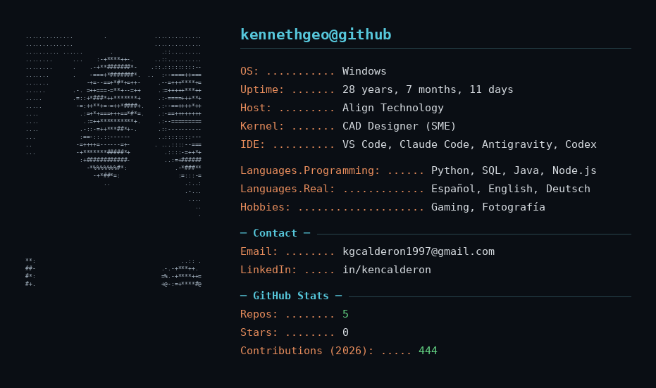

---

# 👋 Hi, I'm Kenneth Calderón · Hola, soy Kenneth

CAD Designer (SME) at **Align Technology** 🦷, and second-year Computer Science student at **UNED** 🇨🇷.

Diseñador CAD (Subject Matter Expert) en Align Technology, y estudiante de segundo año de Ingeniería Informática en la UNED.

## 🛠️ Stack

Python · SQL · Java · Node.js · Power BI

## 🚀 Currently building / Actualmente construyendo

**PassK** — a SaaS platform for digital event management (ticketing, QR check-in, real-time dashboards).

Una plataforma SaaS para la gestión de eventos digitales (tickets, check-in QR, dashboards en tiempo real).

## 🌐 Languages / Idiomas

🇪🇸 Español (native) · 🇬🇧 English (C1) · 🇩🇪 Deutsch (B1)
